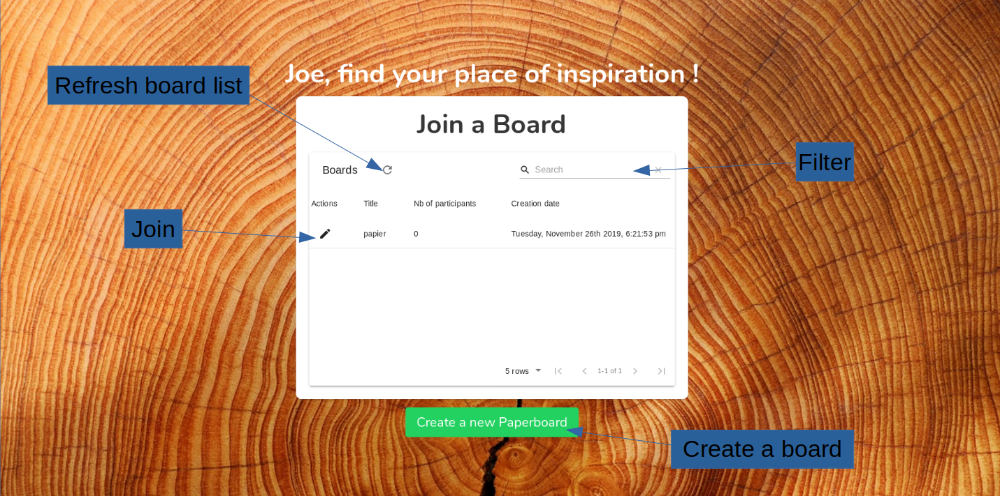
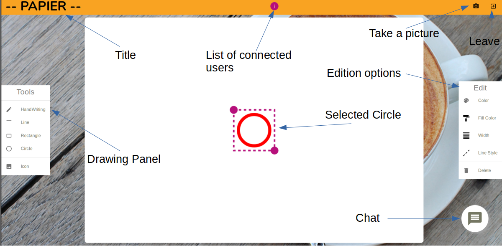
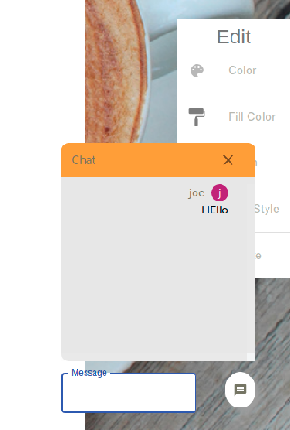
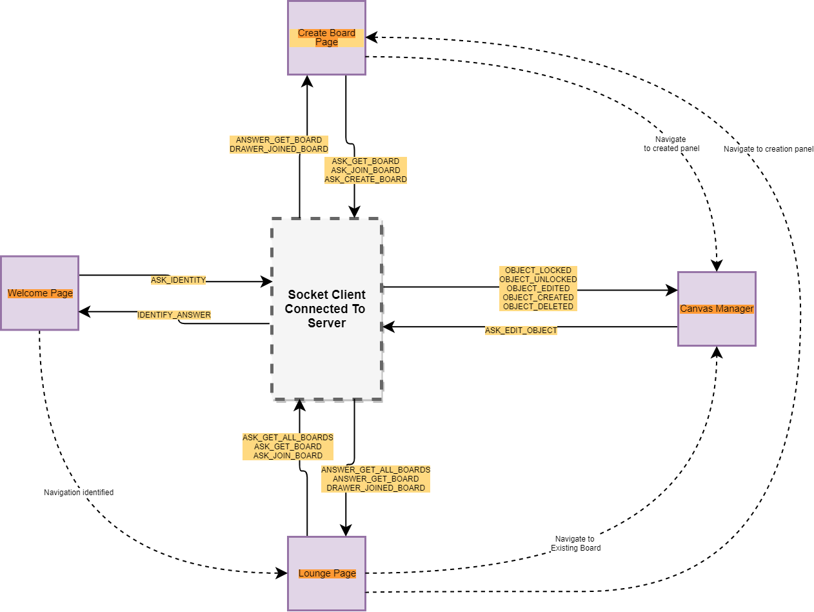
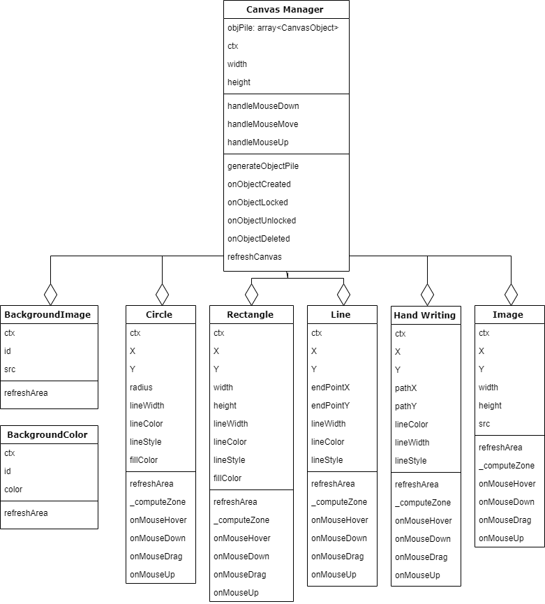

# Just Draw It ! - Client App
Date: 2019 Nov.

Authors : ludovic Descateaux (@mad171) & brieuc loussouarn (@bloussou)

JustDrawIt-Paperboard is a project to pave the basis for a collaborative drawing application. It enable users to create a new Paperboard or join a new Paperboard and sketch it online with many other users.

- [Just Draw It ! - Client App](#just-draw-it----client-app)
  - [User experience](#user-experience)
  - [Setup and Run !](#setup-and-run)
  - [Repository Description](#repository-description)
  - [Architecture and Technical Choices](#architecture-and-technical-choices)
    - [Application Communications with Server](#application-communications-with-server)
    - [Canvas Manager](#canvas-manager)

## User experience
1. Simply authenticate with your favorite pseudo
    * 2 users can't have the same pseudo : Find yours !
    * if you get disconnected the pseudo become free again
2. Create or join a board
    * 2 boards can't have the same title
    * When creating you can choose a background image or a background color for your board
    
    
    Lounge page with all the boards
        
    
    Paperboard with one user and a circle selected.

3. Choose a drawing
    * different drawings are available :
        * Hand Writing
        * Line
        * Rectangle
        * Circle
        * Import icon
4. Edit a shape
    * Select a shape by clicking on it
    * Use the edition options panel to choose your options
    * Click on the drawing, different cursors help you to make actions
    
    
    
    Default cursor
    
    
        
    Cursor when you can select a drawing, click to select it
    
    
            
    Cursor when you can move the selected drawing on the board
    
    
            
    Cursor when you can resize the selected drawing
    
4. Chat and see drawers
    * See who is connected
    * Use the chat to communicate with them
    
                
      Chat after clicking on the chat bubble
5. Take a picture
    * Click on the photo icon to dowload a snapshot of your paperboard !
6. Leave the board
    * Click on leave board
7. Be the member of a new one
    * Join a new Paperboard

## Setup and Run !
First of all you can check out our online demo hosted on a Heroku instance : https://paperboard-just-draw-it.herokuapp.com. 
WARNING : As you can see, we hosted on a free heroku instance which has very low capacities and does not support messages too long. Impact : we limited the size of the images imported to 1.3ko and the socket connection can break if you draw a sketch composed of too many points.

Then you can setup the app on your computer or your own server. For the client-side application here is the proceeding :
1) Install node on your computer and npm
2) Clone this repository or download it on your machine
3) Install all the dependencies with the command line `npm install`
4) Make sure you have added a .env file in the root of the project and filled it with correct values. (You have the list of environment variables to set in `.env.sample`).
5) Set your machine's environment variable REACT_APP_ENVIRONMENT to "develop" so that it takes into account your environment development. `$env:REACT_APP_ENVIRONMENT = "dev"` or `export REACT_APP_ENVIRONMENT="dev"` respectively on Windows or Linux based systems.

You can then launch the app with the command `npm start`.

## Repository Description
- **assets/**: *Images used in the web application*
- **components/**: *Logic components of the app*
  - **chat/**: *Chat-related components (visible in the drawing page)*
  - **canvas-objects/**: *Drawing objects drawn on the collaborative canvas*
  - **CanvasManager.js**: *Main piece of logic manipulating canvas-objects to draw the paperboard in real time*
- **config/**: *Contains the configuration set from the environment variables and the constants of the application*
- **pages/**: *Components handling the layout of each page*
- **socket/**: *Component handling the websocket connection between client and server apps*
- **.package.json**: *node package manage config file*

## Architecture and Technical Choices

We have made the choice of Create-React-App to build this project as a one page application mainly composed of three pages: 
- a Welcome Page used to connect to the server app under a pseudo available
- a Lounge Page used to browse the existing Paperboard
- a Create Paperboard Page to initialize a new paperboard
- a Paperboard Page (main page) used to sketch the board in real time with other participants

The most important points to know about the application :
- We developed a tailor-made Canvas Drawing module based on a CanvasManager component handling a Stack of CanvasObjects according to the signals received from the server and from the user's mouse.
- We also implemented our overlay of the native WebSocket librairy to handle all the web socket communications with the server and linked it with the other components of the app with a Observer Pattern.

### Application Communications with Server
Here is a summary of the communications of the main components of the application with the server. They observe the reception of messages by the web-socket-client instance, and send messages back to the server.

### Canvas Manager

The Canvas Manager is implemented to maintain a local view of the board reacting the user's mouse interactions and to any change signaled by the server. He maintains a stack of Canvas Object drawn successively on the canvas and refreshes the whole Canvas Object Stack any time it is necessary du to changes.

